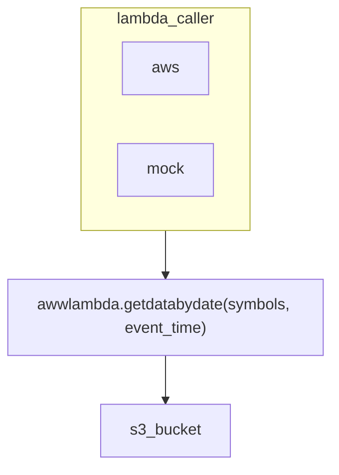

# aws cli set up 

```
curl "https://awscli.amazonaws.com/awscli-exe-linux-x86_64.zip" -o "awscliv2.zip"
unzip awscliv2.zip
sudo ./aws/install
```

# aws sso login set up 

# stack setup

#

# explain logic:
