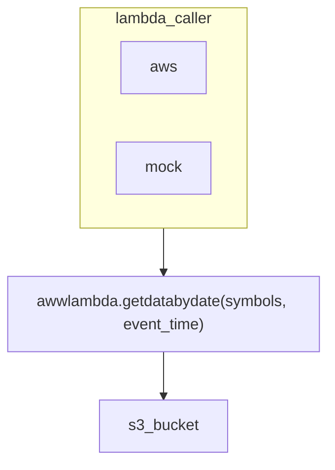

# aws cli set up 

```
curl "https://awscli.amazonaws.com/awscli-exe-linux-x86_64.zip" -o "awscliv2.zip"
unzip awscliv2.zip
sudo ./aws/install
```

# aws sso login set up 

# stack setup

#

# explain logic:


# random cmd
- check the file size under folder
> ls -lRh mocks3yfiance/ > datasize.log

# yfinance 1minute asx data size estimate
8 * 360 * 2000 * 8 * 5 * 52 = 11_980_800_000 \approxeq 12 GB
8 column (ts, OHLCV, dividend, stock split)
360 minute = 10am-4pm (6 hour * 60)
2000 stocks 
8 bytes per number
5 day 
52 weeks 

> 2023-12-14 broken (initial size) 5.63 mb
> a2m <  360 entries, 6kb, 
    > 8 * 360 * 8 = 23040 = 23 kb (so it is compressed) Good!

# TODO: 
- todo in code
    - dump to s3 instead
- check out whether are any of them not pulling data when there are data
- introduce logging where all logs are put into 1 file.
